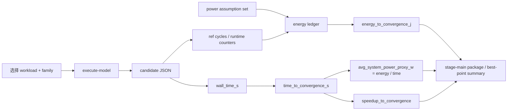

# QE proxy 估算一页汇报版（v0，2026-04-19）

> 若你需要直接转成 slide 草稿，请同时阅读：
> `docs/benchmarks/qe_proxy_estimation_ppt_draft_v0.md`

## 标题
**QE DSE Proxy Estimation — One-Page Summary for F1/F2**

## 一句话结论

当前结果来自 **timed-functional / behavior-level proxy chain**，不是实测功耗；  
但它已经足够支持：

- family 排序
- 时间/能耗趋势判断
- host / DMA / fallback / datapath 的系统瓶颈解释

在当前 mainline 典型 case 上，**F1 一致优于 F2**：

- 更短 `time_to_convergence_s`
- 更低 `energy_to_convergence_j`
- 略低 `avg_system_power_proxy_w`

---

## 1. 一张图看懂 proxy 链

---

## 2. 估算公式

### 时间

\[
time\_to\_convergence\_s = candidate.timing.wall\_time\_s
\]

### speedup

\[
speedup\_to\_convergence
=
\frac{CPU\ baseline\ electrons\_wall\_s}
{candidate\ wall\_time\_s}
\]

### 能耗 proxy

\[
E_{total}
=
E_{host}+E_{device\ runtime}+E_{dma}+E_{datapath}+E_{idle}
\]

### 平均系统功耗 proxy

\[
avg\_system\_power\_proxy\_w
=
\frac{energy\_to\_convergence\_j}
{time\_to\_convergence\_s}
\]

---

## 3. 当前典型值（fresh execute-model）

### A. `si4_pbe_uspp_small`

| Family | time_to_convergence_s | energy_to_convergence_j | avg_system_power_proxy_w | speedup_to_convergence |
| --- | ---: | ---: | ---: | ---: |
| F1 | 0.53 | 13.7511 J | 25.9454 W | 1.0000 |
| F2 | 1.3541 | 35.4508 J | 26.1795 W | 0.3914 |

### B. `graphene_pbe_uspp`

| Family | time_to_convergence_s | energy_to_convergence_j | avg_system_power_proxy_w | speedup_to_convergence |
| --- | ---: | ---: | ---: | ---: |
| F1 | 0.54 | 14.0105 J | 25.9454 W | 1.0000 |
| F2 | 1.1744 | 30.9066 J | 26.3175 W | 0.4598 |

---

## 4. 一个展开算例：`si4_pbe_uspp_small / F1`

### 输入

- `time_to_convergence_s = 0.53`
- `energy_to_convergence_j = 13.7511`

### 能量账本

| 项 | 数值 |
| --- | ---: |
| `E_host_j` | 6.4986 |
| `E_device_runtime_j` | 1.5900 |
| `E_dma_j` | 1.9525 |
| `E_hardware_datapath_j` | 2.6500 |
| `E_idle_static_j` | 1.0600 |

### 校验

\[
6.4986 + 1.5900 + 1.9525 + 2.6500 + 1.0600 \approx 13.7511
\]

\[
13.7511 / 0.53 \approx 25.9454\text{ W}
\]

---

## 5. 当前最适合怎么讲

### 可以讲

- “当前 proxy 链显示 F1 是更优 family”
- “F1 的时间和能耗都低于 F2”
- “当前系统瓶颈仍集中在 host fallback / DMA / diag 路径”

### 不能讲

- “这就是最终实测板级功耗”
- “已经证明 CPU+FPGA 一定优于 GPU”
- “这些 Watt/J 数值可直接当成工程最终结果”

---

## 6. 30 秒汇报口径

> 我们现在的时间与能耗结果来自一条可复核的 proxy 链：行为级模型先给出 wall-time 和 runtime counters，再通过冻结的功率假设集形成 energy ledger，并由此得到总能耗与平均系统功耗 proxy。  
> 在当前两个典型 mainline case 上，F1 相比 F2 一致表现出更短的收敛时间、更低的总能耗和略低的平均系统功耗 proxy，因此当前 family-level 推荐仍然是 F1。  
> 但这些结果的定位仍然是 DSE / 架构排序证据，而不是最终工程实测功耗结论。
