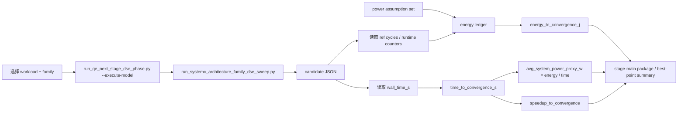

# QE proxy 估算 PPT 四页草稿（v0，2026-04-19）

## 0. 用法

这份文档把当前 proxy 估算材料压成 **4 页 PPT 草稿**：

1. 标题页 + 一句话结论
2. proxy 估算流程图
3. F1/F2 典型值对比表
4. 当前能说什么 / 不能说什么

建议直接把每一页作为一张 slide 的文案底稿使用。

配套材料：

- 详版说明：`docs/benchmarks/qe_proxy_estimation_flow_and_worked_example_v0.md`
- 一页汇报版：`docs/benchmarks/qe_proxy_estimation_onepage_summary_v0.md`
- 工程级实测手册：`docs/benchmarks/qe_engineering_grade_measurement_handbook_v0.md`

---

# Slide 1 — 标题 + 一句话结论

## 标题
**QE DSE Proxy Estimation: Why F1 is currently the recommended family**

## 页面目标

让听众在第一页就明白三件事：

1. 这些结果来自 **proxy estimation chain**
2. 当前主要用途是 **DSE / 架构排序**
3. 在当前 mainline case 上，**F1 consistently beats F2**

## 页面正文（可直接放 PPT）

### 一句话结论

> 当前 `time_to_convergence_s / energy_to_convergence_j / avg_system_power_proxy_w` 来自一条可复核的 timed-functional proxy 链；在 `si4_pbe_uspp_small` 和 `graphene_pbe_uspp` 两个 mainline 典型 case 上，F1 相比 F2 一致表现出更短收敛时间、更低总能耗和略低平均系统功耗 proxy，因此当前 family-level recommendation 仍然是 F1。

### 三个 bullet

- **定位**：这是 DSE / 架构排序证据，不是最终工程实测功耗结论
- **结果**：F1 在当前两个 mainline case 上全部优于 F2
- **价值**：已经足够支持下一步 family 选择、瓶颈解释和工程推进优先级

### 口头补充（speaker note）

- “proxy” 不等于随意猜测，它有明确代码链和公式；
- 但它也不是 measured power，需要和后续 engineering-grade artifact 区分。

---

# Slide 2 — proxy 估算流程图

## 页面目标

回答：

> 这些时间/能耗/平均功耗到底是怎么来的？

## 图（可直接转 PPT）

## 页面右侧 4 个公式

\[
time\_to\_convergence\_s = candidate.timing.wall\_time\_s
\]

\[
speedup\_to\_convergence = \frac{CPU\ baseline\ electrons\_wall\_s}{candidate\ wall\_time\_s}
\]

\[
energy\_to\_convergence\_j = E_{host}+E_{device}+E_{dma}+E_{datapath}+E_{idle}
\]

\[
avg\_system\_power\_proxy\_w = \frac{energy\_to\_convergence\_j}{time\_to\_convergence\_s}
\]

### 口头补充（speaker note）

- 时间直接来自 candidate JSON 的 wall time；
- 能耗来自 ref-cycle + 假设功率常数；
- 平均功耗只是能耗除以时间。

---

# Slide 3 — F1/F2 典型值对比

## 页面目标

回答：

> 在当前 mainline case 上，F1 和 F2 的 proxy 结果到底差多少？

## 表 A：`si4_pbe_uspp_small`

| Family | time_to_convergence_s | energy_to_convergence_j | avg_system_power_proxy_w | speedup_to_convergence |
| --- | ---: | ---: | ---: | ---: |
| F1 | 0.53 | 13.7511 J | 25.9454 W | 1.0000 |
| F2 | 1.3541 | 35.4508 J | 26.1795 W | 0.3914 |

## 表 B：`graphene_pbe_uspp`

| Family | time_to_convergence_s | energy_to_convergence_j | avg_system_power_proxy_w | speedup_to_convergence |
| --- | ---: | ---: | ---: | ---: |
| F1 | 0.54 | 14.0105 J | 25.9454 W | 1.0000 |
| F2 | 1.1744 | 30.9066 J | 26.3175 W | 0.4598 |

## 页面结论框

> 当前两个 mainline case 上，F1 相比 F2：
> - 更快
> - 更省能
> - 平均系统功耗 proxy 略低

### 口头补充（speaker note）

- 当前 best point 也落在 F1；
- 两个 case 的结论方向一致，所以 F1 recommendation 是稳定的。

---

# Slide 4 — 当前能说什么 / 不能说什么

## 页面目标

防止 proxy 结果被误讲成最终工程结论。

## 左栏：现在可以说

- 当前 proxy 链已经足够支持 **family 排序**
- F1 是当前最优 family
- 主要瓶颈仍集中在 **host fallback / DMA / diag 路径**
- `time / energy / avg power proxy` 三个指标已经可以系统级联合比较

## 右栏：现在不能说

- “这就是最终实测板级功耗”
- “已经证明 CPU+FPGA 一定优于 GPU”
- “这些 W/J 数值可以直接作为最终工程数据”

## 页面底部一句话

> 当前结果的正确定位是：**可复核的 proxy-based DSE evidence**；下一步若要升级成工程级结论，必须补真实 GPU / FPGA board artifact、whole-node power、以及 phase-1 evidence closure。

### 口头补充（speaker note）

- 这一页的作用是把 claim boundary 讲清楚；
- 避免老师或听众把 proxy 数值误解成 measured result。
