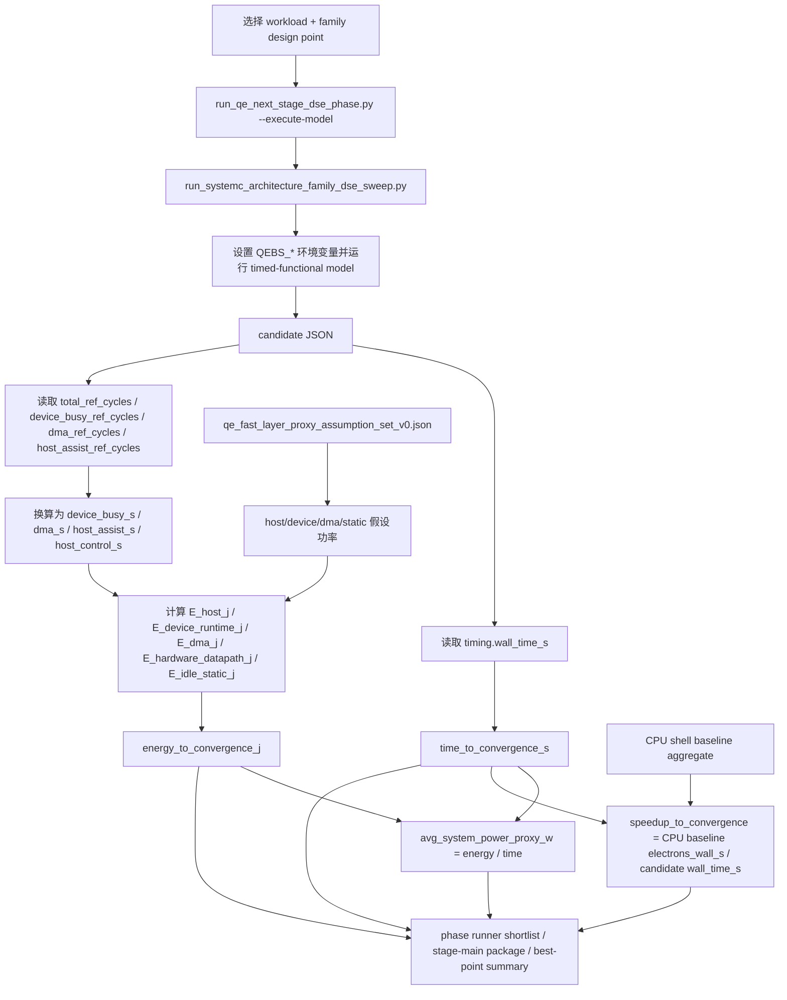

# QE proxy 估算流程图与典型算例（v0，2026-04-19）

## 0. 目的

这份文档回答两个非常具体的问题：

1. 当前 `time_to_convergence_s` / `energy_to_convergence_j` / `avg_system_power_proxy_w` **到底是怎么估出来的**；
2. 用一组典型 case（`si4_pbe_uspp_small` 与 `graphene_pbe_uspp`）时，**F1 / F2 的结果是如何由公式得到的**。

它是：

- `docs/benchmarks/qe_engineering_grade_measurement_handbook_v0.md` 的配套解释页；
- `docs/benchmarks/qe_proxy_estimation_onepage_summary_v0.md` 的详版展开页；
- 一个面向汇报/答辩/自己复核的 **worked example** 文档。

它不是：

- 实测功耗报告；
- GPU / FPGA 最终工程结论。

---

## 1. 一张图看懂当前 proxy 链

---

## 2. 对应到代码里的位置

### 2.1 模型执行入口

行为级/定时功能模型由：

- `tools/benchmarks/run_qe_next_stage_dse_phase.py --execute-model`

触发，内部调用：

- `tools/benchmarks/run_systemc_architecture_family_dse_sweep.py`

关键位置：

- `run_systemc_architecture_family_dse_sweep.py:2206`
  - `run_model_for_row(...)`
- `run_systemc_architecture_family_dse_sweep.py:2130`
  - 通过 `QEBS_RESULT_JSON` 指定 candidate JSON 输出路径

### 2.2 时间

`time_to_convergence_s` 直接来自：

- `candidate["timing"]["wall_time_s"]`

关键位置：

- `run_systemc_architecture_family_dse_sweep.py:1771-1773`

### 2.3 speedup

`speedup_to_convergence` 按下面公式求：

\[
\text{speedup\_to\_convergence}
=
\frac{\text{CPU baseline electrons\_wall\_s}}
{\text{candidate wall\_time\_s}}
\]

关键位置：

- `run_systemc_architecture_family_dse_sweep.py:1775-1783`

### 2.4 能耗 proxy

先从 candidate JSON 里取：

- `total_ref_cycles`
- `device_busy_ref_cycles`
- `dma_ref_cycles`
- `host_assist_ref_cycles`
- `wall_time_s`

然后换算成各部分时间，再乘上假设功率：

- `host_control_w`
- `host_assist_w`
- `dma_w`
- `idle_static_w`
- `family_device_power_w.{F1/F2/F3}.{runtime/datapath}`

关键位置：

- `run_systemc_architecture_family_dse_sweep.py:1545`
  - `energy_proxy_assumptions(...)`
- `run_systemc_architecture_family_dse_sweep.py:1844-1869`
  - `E_host_j`
  - `E_device_runtime_j`
  - `E_dma_j`
  - `E_hardware_datapath_j`
  - `E_idle_static_j`

### 2.5 平均系统功耗 proxy

公式：

\[
\text{avg\_system\_power\_proxy\_w}
=
\frac{\text{energy\_to\_convergence\_j}}
{\text{time\_to\_convergence\_s}}
\]

关键位置：

- `run_systemc_architecture_family_dse_sweep.py:1871-1874`

### 2.6 phase summary / best-point 只是上层透传

phase runner 并不重新发明公式，只是透传：

- `time_to_convergence_s`
- `energy_to_convergence_j`
- `avg_system_power_proxy_w`

关键位置：

- `run_qe_next_stage_dse_phase.py:1357-1360`
- `run_qe_next_stage_dse_phase.py:2166-2169`
- `run_qe_next_stage_dse_phase.py:2315-2317`

---

## 3. 当前假设功率常数

当前默认 assumption set 文件：

- `docs/benchmarks/qe_fast_layer_proxy_assumption_set_v0.json`

其中核心值为：

| 参数 | 当前值 |
| --- | ---: |
| `host_control_w` | 12 W |
| `host_assist_w` | 16 W |
| `dma_w` | 4 W |
| `idle_static_w` | 2 W |
| `F1.runtime` | 3 W |
| `F1.datapath` | 5 W |
| `F2.runtime` | 3.5 W |
| `F2.datapath` | 6.5 W |

这解释了为什么当前数值适合：

- 架构比较
- 趋势判断
- DSE 排序

但**不应直接当作工程实测结论**。

---

## 4. 典型算例 A：`si4_pbe_uspp_small`

下面的数字来自 fresh execute-model 运行。

### 4.1 F1

| 指标 | 数值 |
| --- | ---: |
| `time_to_convergence_s` | 0.53 |
| `energy_to_convergence_j` | 13.7511 J |
| `avg_system_power_proxy_w` | 25.9454 W |
| `speedup_to_convergence` | 1.0 |

能量账本：

| 能量项 | 数值 |
| --- | ---: |
| `E_host_j` | 6.4986 |
| `E_device_runtime_j` | 1.5900 |
| `E_dma_j` | 1.9525 |
| `E_hardware_datapath_j` | 2.6500 |
| `E_idle_static_j` | 1.0600 |

校验：

\[
6.4986 + 1.5900 + 1.9525 + 2.6500 + 1.0600 \approx 13.7511
\]

\[
\frac{13.7511}{0.53} \approx 25.9454\text{ W}
\]

### 4.2 F2

| 指标 | 数值 |
| --- | ---: |
| `time_to_convergence_s` | 1.3541 |
| `energy_to_convergence_j` | 35.4508 J |
| `avg_system_power_proxy_w` | 26.1795 W |
| `speedup_to_convergence` | 0.3914 |

能量账本：

| 能量项 | 数值 |
| --- | ---: |
| `E_host_j` | 16.4473 |
| `E_device_runtime_j` | 4.7395 |
| `E_dma_j` | 2.7538 |
| `E_hardware_datapath_j` | 8.8019 |
| `E_idle_static_j` | 2.7083 |

校验：

\[
16.4473 + 4.7395 + 2.7538 + 8.8019 + 2.7083 \approx 35.4508
\]

\[
\frac{35.4508}{1.3541} \approx 26.1795\text{ W}
\]

### 4.3 对比结论

在当前 proxy 下：

- **F1 更快**
- **F1 更省能**
- **F1 的平均系统功耗 proxy 也略低**

---

## 5. 典型算例 B：`graphene_pbe_uspp`

### 5.1 F1

| 指标 | 数值 |
| --- | ---: |
| `time_to_convergence_s` | 0.54 |
| `energy_to_convergence_j` | 14.0105 J |
| `avg_system_power_proxy_w` | 25.9454 W |
| `speedup_to_convergence` | 1.0 |

### 5.2 F2

| 指标 | 数值 |
| --- | ---: |
| `time_to_convergence_s` | 1.1744 |
| `energy_to_convergence_j` | 30.9066 J |
| `avg_system_power_proxy_w` | 26.3175 W |
| `speedup_to_convergence` | 0.4598 |

### 5.3 对比结论

和 `si4_pbe_uspp_small` 一样，在当前 proxy 下：

- **F1 更快**
- **F1 更省能**
- **F1 的平均系统功耗 proxy 略低于 F2**

---

## 6. 这组结果最适合怎么用

### 适合

- family 排序
- DSE 筛点
- host / DMA / fallback / datapath 的瓶颈分析
- 向老师解释“为什么 F1 目前是推荐点”

### 不适合

- 直接写成实测 whole-node power 结论
- 直接和真实 GPU / 真实 FPGA board 做工程最终比较
- 拿 proxy 数值当成论文里最终 measured table

---

## 7. 一句话汇报版结论

> 当前结果的来源是：  
> **时间 = timed-functional 模型输出的 wall time**；  
> **能耗 = 运行量 × 功率假设**；  
> **平均功耗 = 能耗 ÷ 时间**。  
> 因此它已经足够做系统级 DSE 和架构排序，但仍然是 proxy，不是工程实测功耗。
